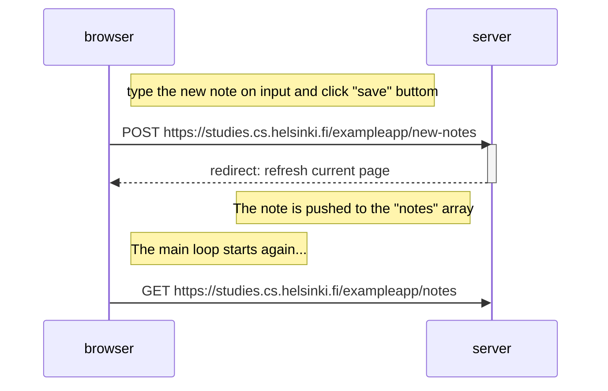

# 0.4 exercise
## make a new note

```mermaid
  sequenceDiagram
    participant browser
    participant server

    Note right of browser: type the new note on input and click "save" buttom
    browser->>server: POST https://studies.cs.helsinki.fi/exampleapp/new-notes
    activate server
    server-->>browser: redirect: refresh current page
    deactivate server
    Note left of server: The note is pushed to the "notes" array

    Note right of browser: The main loop starts again...
    browser->>server: GET https://studies.cs.helsinki.fi/exampleapp/notes
   
```