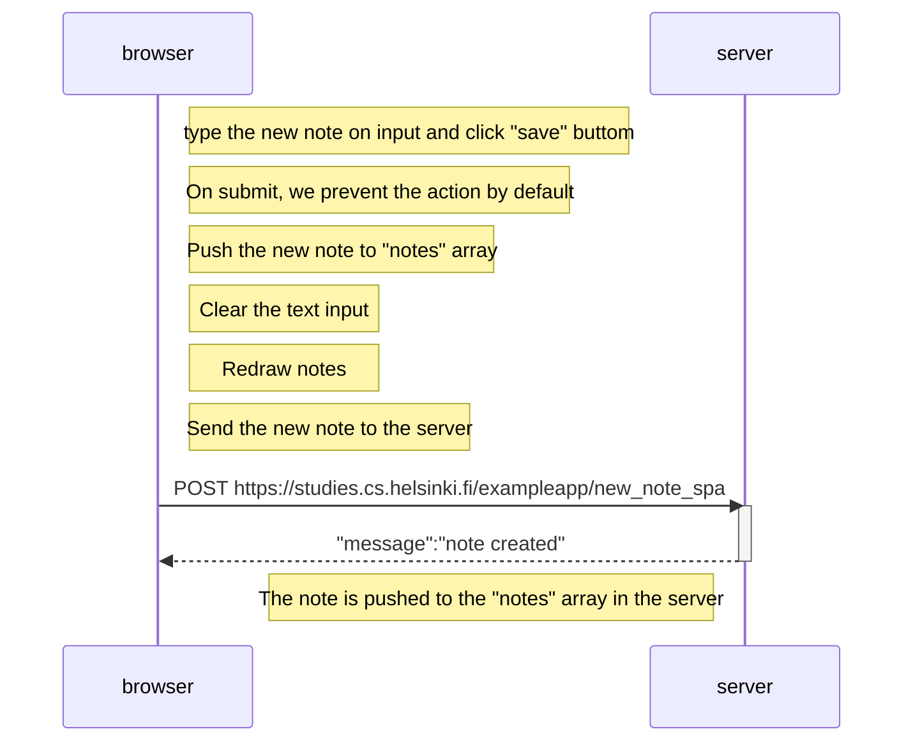

# 0.6 exercise
## make a new note in SPA

```mermaid
  sequenceDiagram
    participant browser
    participant server

    Note right of browser: type the new note on input and click "save" buttom
    Note right of browser: On submit, we prevent the action by default
    Note right of browser: Push the new note to "notes" array
    Note right of browser: Clear the text input
    Note right of browser: Redraw notes
    Note right of browser: Send the new note to the server
    browser->>server: POST https://studies.cs.helsinki.fi/exampleapp/new_note_spa
    activate server
    server-->>browser: "message":"note created"
    deactivate server
    Note left of server: The note is pushed to the "notes" array in the server
```